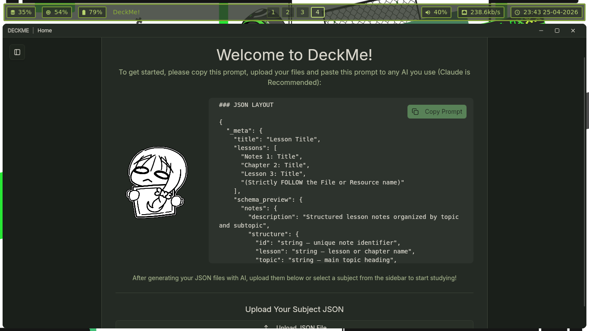
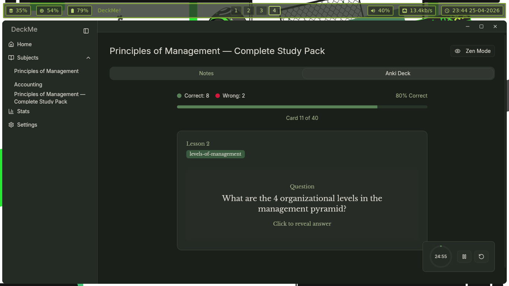
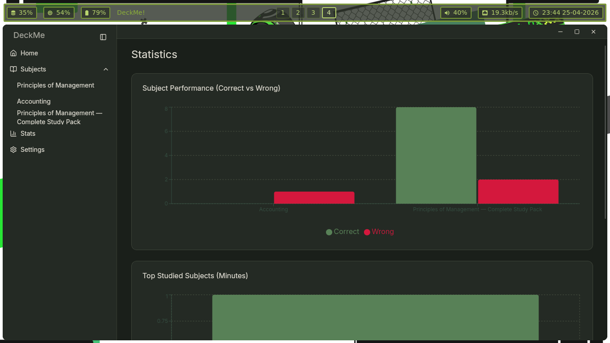
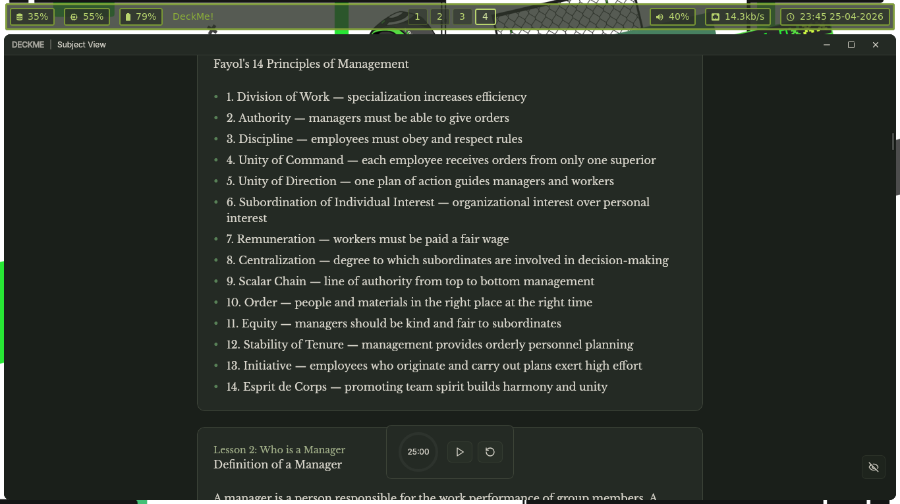
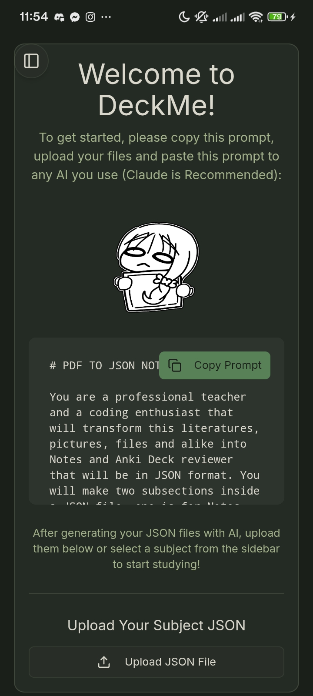
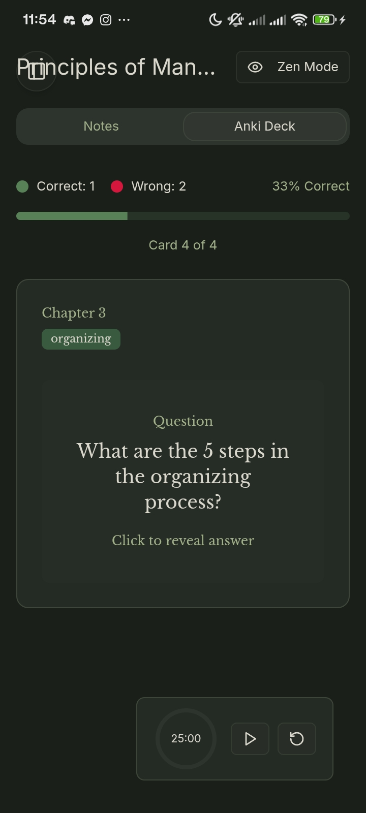
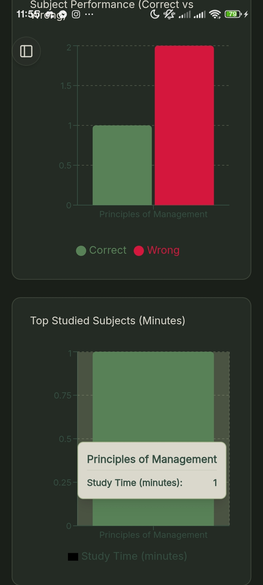
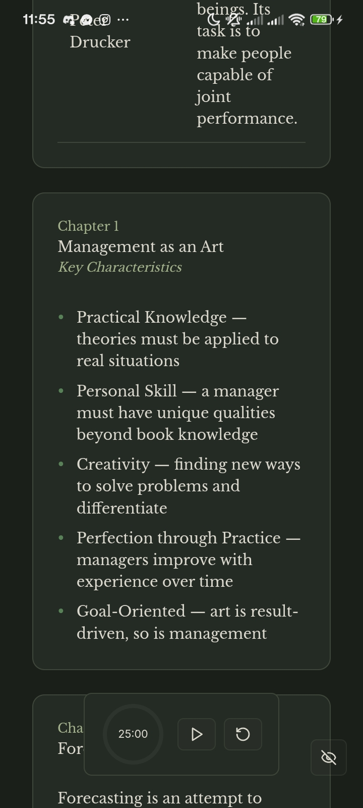

# DeckMe!

*"It was for personal use but meh why not share it?"*

DeckMe is an AnkiDeck inspired Application for both Desktop and Mobile Devices. Its main use is to help students and others alike to read quick notes and memorize information for upcoming tests and such.

[English](README.md) · [Changelog](CHANGELOG.md) · [Report Bug](https://github.com/novakamiii/DeckMe/issues)

---

## ✨ Features

- **🤖 AI-Powered Conversion**: Simply copy our optimized AI prompt, paste it into your favorite LLM (Claude recommended), and get perfectly structured flashcard JSONs.
- **📱 Cross-Platform**: Study anywhere. Native builds available for Windows, Linux, Android, and iOS.
- **🧘 Zen Mode**: A distraction-free interface designed for deep focus and active recall.
- **⏱️ Pomodoro Integration**: Built-in timer to keep your study sessions structured and productive.
- **📊 Performance Analytics**: Track your progress with detailed charts and time-tracking statistics.
- **🌿 Aesthetic Design**: Premium "Brunswick Green" palette with a modern, responsive UX.

---

## 📸 Snapshots

### **Desktop**

|  |  |
| :---: | :---: |
| **Smart Onboarding** | **Active Recall Deck** |
|  |  |
| **Progress Tracking** | **Structured Notes** |

### **Mobile**

|  |  |
| :---: | :---: |
| **Smart Onboarding** | **Active Recall Deck** |
|  |  |
| **Progress Tracking** | **Structured Notes** |

---

## 🚀 Getting Started

### 1. Installation
Download the latest version for your platform from the [Releases](https://github.com/novakamiii/DeckMe/releases) page.

### 2. Prepare Your Decks
1. Copy the **AI Prompt** from the Welcome screen.
2. Paste it into an AI (like Claude) along with your notes or files.
3. Upload the generated JSON back into DeckMe!

### 3. Start Studying
Select your subject from the sidebar and choose between **Notes View** for review or **Deck View** for active recall.

---

## 🛠️ Tech Stack

- **Frontend**: [React](https://reactjs.org/) + [Vite](https://vitejs.dev/) + [Tailwind CSS](https://tailwindcss.com/)
- **Native**: [Tauri](https://tauri.app/) (Desktop) & [Capacitor](https://capacitorjs.com/) (Mobile)
- **UI Components**: [Shadcn/UI](https://ui.shadcn.com/)
- **Charts & Icons**: [Recharts](https://recharts.org/) & [Lucide React](https://lucide.dev/)

---

## 🤝 Contributing

1. Fork the Project
2. Create your Feature Branch (`git checkout -b feature/AmazingFeature`)
3. Commit your Changes (`git commit -m 'Add some AmazingFeature'`)
4. Push to the Branch (`git push origin feature/AmazingFeature`)
5. Open a Pull Request

---

## 📄 License

Distributed under the Apache License 2.0. See `LICENSE` for more information.

Built with ❤️ by [novakamiii](https://github.com/novakamiii)

